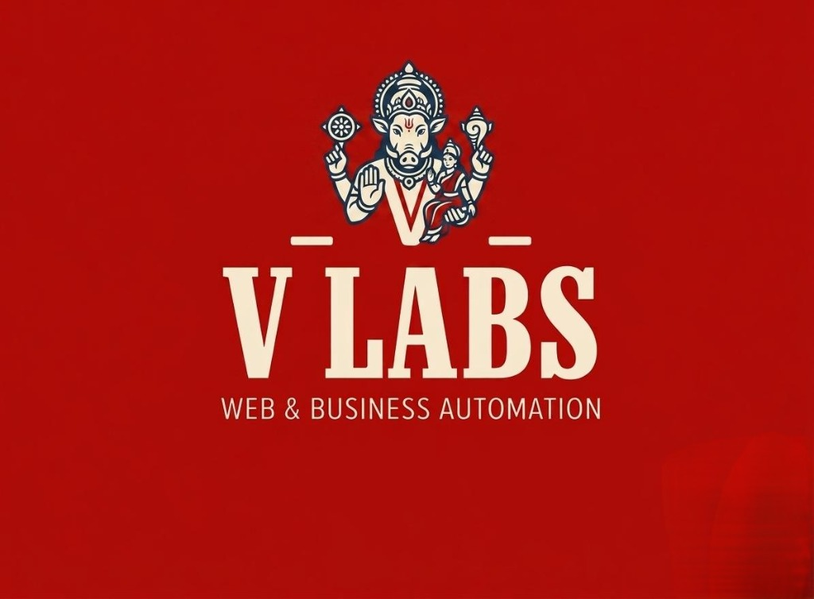
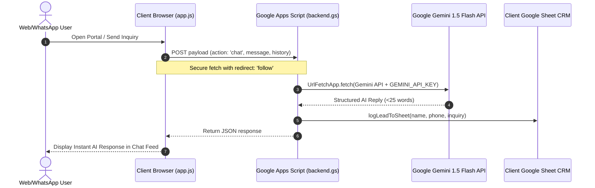

<div align="center">

  

  # V LABS
  ### Vizag's 24-Hour Digital Studio & Business Automation Engine

  [](https://github.com/sreeramvajjhala-arch/V-LABS-/actions/workflows/ci.yml)
  [](LICENSE)
  [](#security--client-architecture)

</div>

---

## Overview

**V Labs** delivers high-converting 1-page business web portals integrated with ultra-fast **Google Gemini 1.5 Flash AI WhatsApp Receptionists** and automated **Google Sheets CRMs** — fully configured and deployed in under 24 hours.

Designed specifically for fast-growing enterprises, V Labs operates on a **flat one-time setup fee with zero recurring monthly agency retainers** and **100% code & account ownership handed over to the business owner**.

> [!IMPORTANT]
> **Zero Client Keys Guarantee:** `app.js` contains **0 Gemini API keys**. All AI inference and lead logging requests pass through a secure serverless Google Apps Script gateway (`backend.gs`).

---

## Key Features

- ⚡ **24-Hour Turnkey Deployment**: High-converting portal, Gemini AI WhatsApp agent, and Sheets CRM live within 24 hours.
- 🤖 **Gemini 1.5 Flash AI Receptionist**: Handles customer inquiries, qualifies prospects, books appointments, and provides instant quotes 24/7.
- 📊 **Automated Google Sheets CRM**: Automatically records every lead's name, phone number, and inquiry into a private Google Sheet.
- 📱 **Responsive Craft Architecture**: Optimized for all viewports (`280px` to `1920px+`) with `viewport-fit=cover` safe-area support, custom GPU-accelerated mobile drawer, and `16px` non-zooming mobile inputs on iOS Safari.
- 🎨 **Cinzel & Crimson Aesthetic**: Premium glassmorphic UI styled with deep crimson gradients (`#4A0000` to `#1A0202`) and `@supports not (backdrop-filter)` fallback styling.
- 💬 **Human WhatsApp Escape Hatch**: Integrated direct WhatsApp link ([wa.me/996655273](https://wa.me/996655273)) letting users bypass AI to speak with a human anytime.

---

## Tech Stack

| Layer | Technology |
|---|---|
| **Frontend Architecture** | Pure HTML5, Vanilla JavaScript (`app.js`) |
| **Styling & Layout** | Tailwind CSS CDN, Font Awesome 6.5 |
| **Typography** | Google Fonts (`Cinzel` for serif headlines, `Plus Jakarta Sans` for body) |
| **Backend & CRM Gateway** | Google Apps Script (`backend.gs`) |
| **AI Intelligence Engine** | Google Gemini 1.5 Flash API (proxied via `UrlFetchApp.fetch()`) |
| **Test Automation** | Custom Node.js TDD Suite (`tests/suite.js` — 32 test assertions) |
| **CI/CD Pipeline** | GitHub Actions (`.github/workflows/ci.yml`) |

---

## Quick Start

### 1. Clone & Serve Locally

```bash
# Clone repository
git clone https://github.com/sreeramvajjhala-arch/V-LABS-.git
cd V-LABS-

# Serve locally on port 8080
python -m http.server 8080
```

Open `http://localhost:8080` in your web browser.

### 2. Run Automated TDD Test Suite

```bash
node tests/suite.js
```

---

## Architecture & Data Flow



---

## Commands Reference

| Command | Action |
|---|---|
| `python -m http.server 8080` | Start local HTTP development server on port 8080 |
| `node tests/suite.js` | Run 32-assertion automated TDD test suite |
| `git status` | Verify working tree status |

---

## Security & Client Architecture

> [!TIP]
> Client security is enforced at the architectural level.

- **Key Isolation**: The client script `app.js` fetches the Apps Script Webhook. No Gemini keys or credentials exist on the client side.
- **XSS Protection**: `escapeHtml()` in `app.js` type-guards against non-string parameters (`null`, `undefined`, numbers) and sanitizes HTML tags.
- **CORS Handling**: `backend.gs` implements `doOptions(e)` to handle CORS preflight checks without blocking browser fetches.

---

## Architecture Decisions

See our recorded Architecture Decision Records in `docs/decisions/`:

- **[ADR-001](docs/decisions/0001-apps-script-gemini-proxy-and-sheets-crm.md)**: Zero-Retainer Google Apps Script Gateway & Gemini AI Proxy.
